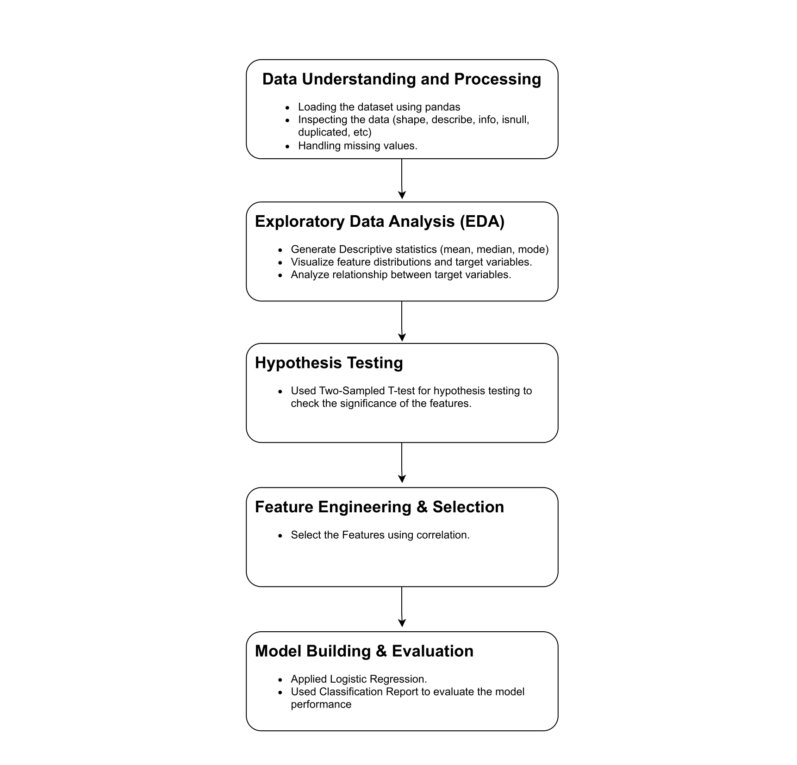

</head> <body> <h1>Company Bankruptcy Prediction using Financial Data</h1> <h2>Project Overview</h2> 
This project aims to predict the likelihood of a company going bankrupt based on financial data. The analysis involves data preprocessing, exploratory data analysis, hypothesis testing, feature engineering and selection, and applying machine learning techniques for classification. The project delivers a detailed report, Python code, supporting visualizations and tables, and a presentation summarizing the findings and recommendations. 
 <h2>Dataset</h2> 
The dataset used for this project contains 96 columns, with 95 features and 1 target variable. The target variable is "Bankrupt?" with 1 indicating bankruptcy and 0 indicating non-bankruptcy.
 <h2>Methodology</h2> <ol> <li><strong>Data Understanding and Preprocessing:</strong> The dataset was loaded and inspected for missing values and outliers. Missing values were handled appropriately, and outliers were detected and imputed.</li> <li><strong>Exploratory Data Analysis (EDA):</strong> Descriptive statistics were generated to summarize the data. Feature distributions and the target variable were visualized, and relationships between features and the target variable were analyzed.</li> <li><strong>Hypothesis Testing:</strong> Hypothesis testing was performed to identify significant features influencing bankruptcy.</li> <li><strong>Feature Engineering and Selection:</strong> Feature were selected on the basis of Correlation between them. </li> <li><strong>Modeling:</strong> The data was split into training and testing sets. Logistic Regression was applied for classification, and model performance was evaluated using appropriate metrics.</li> <li><strong>Model Interpretation and Insights:</strong> Model coefficients were interpreted to understand feature impact. Key insights were summarized. </li> </ol> <h2>Results</h2> 
The project resulted in a predictive model that accurately classifies companies as bankrupt or non-bankrupt based on financial data. The model was evaluated using appropriate metrics, and insights were gained into the features that have the most significant impact on bankruptcy.
 <h2>Technologies Used</h2> <ul> <li>Python</li> <li>Pandas</li> <li>NumPy</li> <li>Matplotlib</li> <li>Seaborn</li> <li>Scikit-learn</li> </ul> <h2>Project Files</h2> <ul> <li><code>bankruptcy_prediction.ipynb</code>: Jupyter notebook containing the Python code and analysis</li> <li><code>bankruptcy_report.pdf</code>: Detailed report of the analysis</li> <li><code>presentation.pptx</code>: Presentation summarizing the findings and recommendations</li> <li><code>visualizations/</code>: Directory containing supporting visualizations and tables</li> </ul> <h2>Contact</h2> 
For any questions or inquiries, please contact <strong>Gaurav Khole</strong> at <strong>gkhole1605@gmail.com</strong>.
 <h2>Workflow Diagram</h2>  </body> </html>
